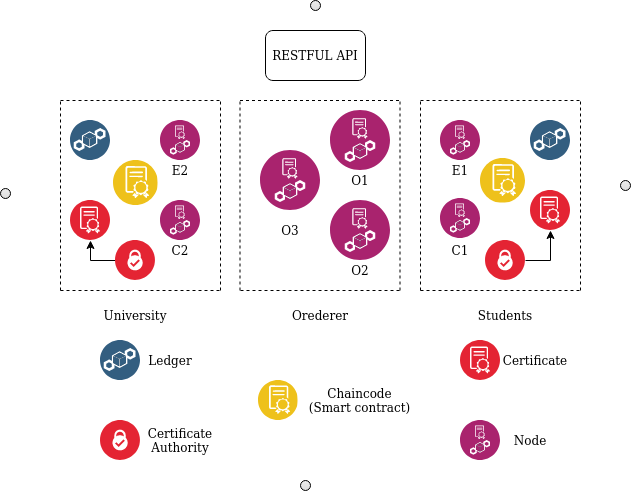
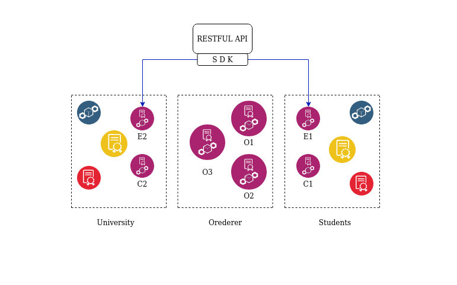
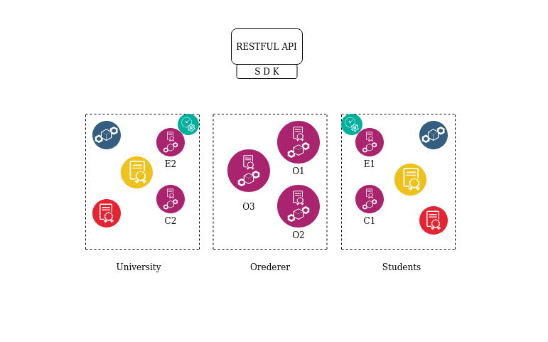
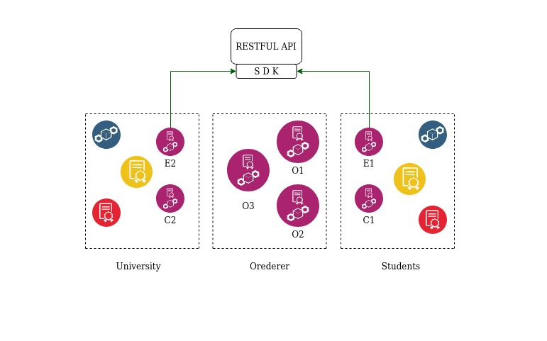
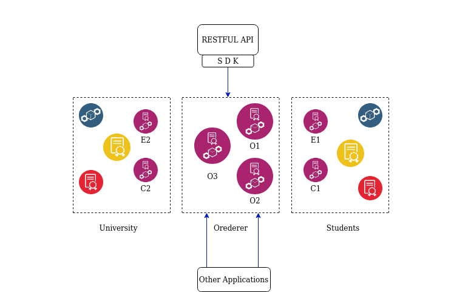
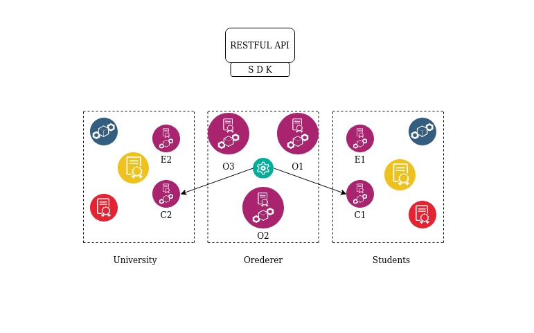
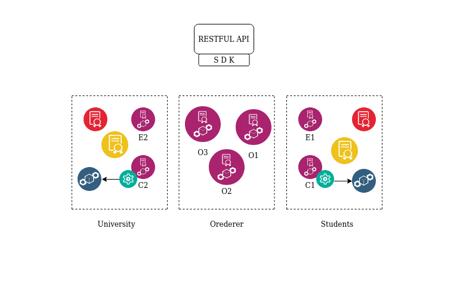
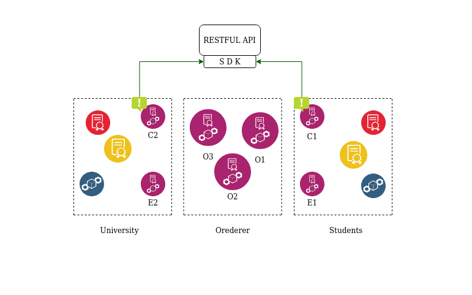

# Blockchain : 
## Introduction : 
October 31, 2008, Satoshi Nakamoto which is an anonymous person or organization has published a white paper that explains an innovative approach used to send money from sender to receiver directly with no mediation of any financial authority. this paper gave the definition and the domain of the use of this concept. And it started first with Bitcoin. Cyber scientists discovered that this technology might be gathered to build safe and vigorous applications that can subsite a revolution in the way systems currently work .this foundation technology was named “Blockchain” also referred to as Distributed ledger technology.
 
## public vs private : ##
we can categorize blockchains in two major types:  
Permissionless blockchains also known as public , is an open overlay network with no barrier to use it, in other words, Anyone can run a node, access a wallet and write data onto and transact within the blockchain as long as they follow the rules of the smart contract. There is no way to censor or track anyone on the permissionless bitcoin blockchain. the most knowing public blockchains are Bitcoin and ethereum.   On the other hand,permissioned blockchains also known as “private” blockchains, operate a blockchain amongst a set of known identified and often vetted participants operating under a governance model that yields a certain degree of trust. A permissioned blockchain provides a way to secure the interactions among a bunch of organizations that may not totally trust each other.  
In a voting app scenario all electors must be known and have the right to vote, therefore we will use a private blockchain that can fulfill these requirements.
## Hperledger Fabric : ##
The progress of Hyperledger Fabric has been launched by Digital Asset and IBM, then endowed to the Linux Foundation, this last is now operating as part of the umbrella project Hyperledger .the hyperledger supply a suitable environment of solutions for the right use of blockchain technologies
the main properties that specify the hyperledger Fabric are :
### modularity and configurability :
-fabric is characterized by being modular and configurable when it's about its architecture, this last smooth its development and makes it adaptable and ameliorated for a huge variety of uses: finance, banking, insurance, human resources, health and much more.
### Writing smart contracts in general-purpose programming languages :
-Fabric is the first distributed ledger platform that gave access to smart contracts to be written in a variety of programming languages such as Golang, java, and Node Js.
### Permissioned :
- Fabric permits to dominate the entry of participants that must have known identities in the system. No unknown users can transact in the Hyperledger Fabric network.
### Pluggable consensus protocol :
- Fabric holds up the activation of various consensus protocols, the user will choose according to the context. In a context where all users participate in the same company, an easy consensus protocol like “The fault-Tolerant Crash” can be exploited to fight shy of baseless performance penalties. And in a context where the actors are more suburbanized, it will then be suitable to use fitting consensus protocol such as “The Byzantine Fault Tolerant (BTF)”.
### Consensus protocol without currency mining :
- the lack of an incentive factor for consensus provided by cryptocurrency mining facilitates the work of consensus building and as a result the working of the whole system.
### Performance and scalability :
Fabric keep up a high transaction rate and can plate outstandingly. 
Several research papers have been published studying and testing the performance capabilities of Hyperledger Fabric. The latest scaled Fabric to [20,000 transactions per second](https://arxiv.org/abs/1901.00910). 
> Hyperledger Fabric is an Open source enterprise-grade permissioned distributed ledger technology (DLT) platform, designed for use in enterprise contexts, that delivers some key differentiating capabilities over other popular distributed ledger or blockchain platforms. 
<cite>[Hyperledger Fabric](https://hyperledger-fabric.readthedocs.io/en/release-2.0/whatis.html#hyperledger-fabric)</cite>
 
 
## Convector ##
Convector Suite is a suite of Open Source tools developed by Worldsibu to facilitate the creation, testing, and deployment applications for enterprise blockchains. The suite is composed of three main products:
- Convector Smart Contracts:
a framework for the development of smart contracts in TypeScript which is a strict syntactical superset of JavaScript. 
Since March 2019 convector smart contracts has been part of the hyperledger labs.
Convector uses the Model/Controller pattern to provide a  comfortable way of writing chaincode by having Models describing the shape of the data and Controllers describing the actions and rules that apply to the models.
- Convector CLI: the Command line tool to manage Convector projects. It is fully integrated with Hurley as well.
- Hurley:
a Command line tool to simplifying creating and interacting with a Hyperledger Fabric network.
 
## Architecture : ##
 

 
 
 
 
A Hyperledger Fabric network has these components:
- Channel: Channels are sub-networks formed by a group of nodes. This capability allows a collection of peers to create a separate ledger to share transactions exclusively between them.
- Endorsement Policy: define which endorser nodes need to agree on the output of a transaction before it can be submitted to the ledger. The endorsement policy can be defined for each smart contract in the network.
- Ledger: record immutable transactions and it is consists of two components, the world state which is a NoSQL database that describes the state of the ledger at a given point in time in the meantime hyperledger fabric supports CouchDB and LevelDB. The blockchain is sequence of blocks that records all transactions.
- ChainCode: also known as a Smart contract is software that contains the business logic of the system. A Smart contract is invoked when an end-user needs to submit a transaction to the blockchain.
- Membership Services Provider (MSP): The MSP is implemented as a Certificate Authority (CA) to manage certificates used to authenticate and provide the cryptographic identities associated with network components and users. the CA enables Hyperledger Fabric as a Private and Permissioned network.
- Nodes: Peers are a key components of the network because they hold ledgers and smart contracts. But unlike Ethereum in Hyperledger Fabric network peers have different roles. therefor, There are different types of peer nodes in the network :
   - Endorser peer: the main role of an Endorser peer is to validate the transaction, in other words Check certificate details and roles of the requester then it Executes the smart contract and simulates the result of the transaction. But it does not update the ledger. 
   In the end, the Endorser may approve or disapprove the transaction. 
   - Anchor peer :
   Anchor peer receives updates and broadcasts it to the other peers in the same organization. Anchor peer can be discovered by the Orderer peer or any other peer in the channel.
   - Orderer peer: Orderer peer is considered as the central communication channel for the Hyperledger Fabric network, it creates the block and delivers that to all the committer peers.   Orderer is developed on top of a message-oriented Middleware.Hyperledger fabric supports two types of ordering protocols:
       - Solo: Single point failure, Suitable for a development environment.
       - Kafka: Kafka is messaging software that has a high throughput Fault Tolerant feature, Suitable for a production environment.
   - Committer peer: add transactions received by orderer and approved by endorser nodes in the ledger.In many cases committing peer and endorsing peer could be the same peer.
## WorkFlow : ##
 
the consensus in hyperledger fabric network is achieved using the following high level transaction flow, the client application is going to submit the transaction to a few peers, and those peers going to execute this transaction and agree that the output is the same across all of them. Thus, they are all going to find the output of the transaction and they will add their signature to it.the client application has to collect endorsements from multiple peers in the network to say that this transaction is valid. Once you collect sufficient signatures then the transaction can be submitted for ordering. Later, the ordering service is going to order the transactions and ensure that all of them are totally ordered across all the nodes. the last step in the transaction flow is validation where peers receive the block from the orderer service and add it to the blockchain then they update the world state with the valid transactions . in more details we can list the transaction flow in 7 steps :
- Step 1 : Propose Transaction  

 
 
a client application or a user is going to propose a particular transaction by passing its identity in the network and specifying the function invoked in the chaincode with its input and then the client application will send that transaction to multiple endorsing peers (E1 and E2 in this case ) which determined by an endorsement policy.
- Step 2 : Execute Proposed Transaction  

 
 
the endorser peers will execute the transaction but they are not going to commit to the blockchain. Each execution will capture the set of read and write data, called RW sets, which will be signed by the endorser peer
- Step 3 : Proposal Response  
 
 
Read-Write sets are asynchronously returned to the client application .
- Step 4 : Order Transaction  
  
 
the client application submits responses as a transaction to the ordering service after collecting sufficient endorsements that satisfies the endorsement policy. the submission of the transaction is happening simultaneously across the network.
- Step 5 : Deliver Transaction  
  
 
the ordering services collect transactions into proposed blocks for distribution to committing peers. Peers can resend the transactions to other peers in a hierarchy
- Step 6 : Validate Transaction  
  
 
Every committing peer validates the transaction against the endorsement policy and checks write and read sets are still valid for the current world state. validated transactions are applied to the world state and stored on the ledger. On the other hand, invalid transactions do not update the world state but they are saved on the ledger.
- Step 7 : Notify Transaction  
  
 
Applications will be notified by each peer to which they are connected when blocks are added to the blockchain.
 
## Conclusion :  

 